# Nextouch 🖱️📱

> **Professional Remote Control Solution for Windows**  
> *Zero latency. Zero configuration. 100% Privacy.*

## � Get the App

**Download Ready-to-Use Installers:**  
👉 **[Official Website (nextouch.futumore.pl)](https://nextouch.futumore.pl)**

_Available for Android and Windows 10/11._

---

## 👨‍💻 Technical Architecture (For Recruiters)

```mermaid
graph LR
    %% Styles
    classDef mobile fill:#e3f2fd,stroke:#1565c0,stroke-width:2px,color:black;
    classDef desktop fill:#f3e5f5,stroke:#7b1fa2,stroke-width:2px,color:black;
    classDef cloud fill:#e8f5e9,stroke:#2e7d32,stroke-width:2px,color:black;
    classDef sys fill:#eceff1,stroke:#455a64,stroke-width:2px,color:black;

    subgraph Phone [📱 Mobile Device]
        direction TB
        Touch[👆 Touch Input] -->|Gestures| App[React Native App]
        class Touch,App mobile;
    end

    subgraph PC [🖥️ Desktop Computer]
        direction TB
        Server[Electron Server] -->|JSON| Core[C# Native Core]
        Core -->|P/Invoke| WinAPI[User32.dll]
        WinAPI -->|Inject| System[Cursor / Keys]
        class Server,Core desktop;
        class WinAPI,System sys;
    end

    subgraph Web [☁️ Licensing]
        direction TB
        Stripe -->|Pay| API[License API]
        API -.->|Verify| Server
        class Stripe,API cloud;
    end

    %% Connections
    App == WebSocket (P2P) ==> Server
```

This project demonstrates a full-stack implementation of a real-time, low-latency remote control system. It solves complex networking challenges (firewalls, dynamic IPs, subnets) while maintaining a polished consumer-grade UX.

### 🖥️ Desktop (Receiver)
- **Core**: Electron (TypeScript) for system tray management and UI.
- **Native Backend (C#)**: Custom-built **C# .NET** native module utilizing **P/Invoke** to interface directly with `user32.dll`.
    - **Why C#?**: Chosen for millisecond-precision input injection (Mouse moves, Clicks, Scrolls) that standard Node.js libraries could not achieve reliably.
    - **Interop**: Efficient standard I/O communication between Electron and the C# process.
- **Networking**: WebSocket server with **Dynamic Interface Binding**. Automatically listens on all available network interfaces (WiFi, Ethernet, USB Tethering) to ensure connectivity even in complex subnet setups.
- **Security**: Automated **Windows Firewall** rule management via NSIS installer logic to ensure seamless initial setup.

### 📱 Mobile (Controller)
- **Framework**: React Native (Expo).
- **Protocol**: Custom **P2P WebSocket Client** with "Race-to-Connect" logic.
    - Simultanously attempts connection to multiple detected IPs (Local LAN, Tethering) and locks onto the first stable route.
    - **Auto-Reconnect**: Robust state management handles backgrounding and network switches without user intervention.
- **Performance**: High-frequency gesture tracking (60fps) using `react-native-gesture-handler`.

### ☁️ Web Services & Monetization
- **Backend**: Node.js/Express REST API.
- **Payments**: Full **Stripe** integration (Checkout Sessions + Webhooks).
- **Licensing Engine**:
    - Generates unique license keys (`NXTH-XXXX-XXXX-XXXX`) upon verified payment.
    - Implements **Hardware ID Binding** to prevent multi-device abuse.
    - Secure validation endpoints used by the Desktop client.
- **Security**: Rate-limiting, Helmet.js headers, and CORS configuration.

---

## 🔒 Licensing & Usage

**© Copyright 2026 Nextouch / [Your Name]. All Rights Reserved.**

**Proprietary Software.**  
This source code is published on GitHub **solely for portfolio and technical review purposes**.

- ❌ **No Commercial Use**: You may not use this code for commercial purposes.
- ❌ **No Redistribution**: You may not redistribute, modify, or sublicense this code.
- ✅ **Educational Use**: Recruiters and engineers are welcome to review the architecture and code quality.

---

## ✨ Key Features

- **Standard Interactions**: Cursor move, Left/Right click, Scroll.
- **Multi-Touch Gestures**: Two-finger scroll, tap-to-click.
- **Smart Connectivity**: Automatically detects and connects via LAN or Tethering (QR Code handshake).
- **Virtual Keyboard**: Full QWERTY input with modifier keys (Ctrl, Alt, Shift).
- **Privacy First**: Direct P2P connection. No data ever leaves the local network.
